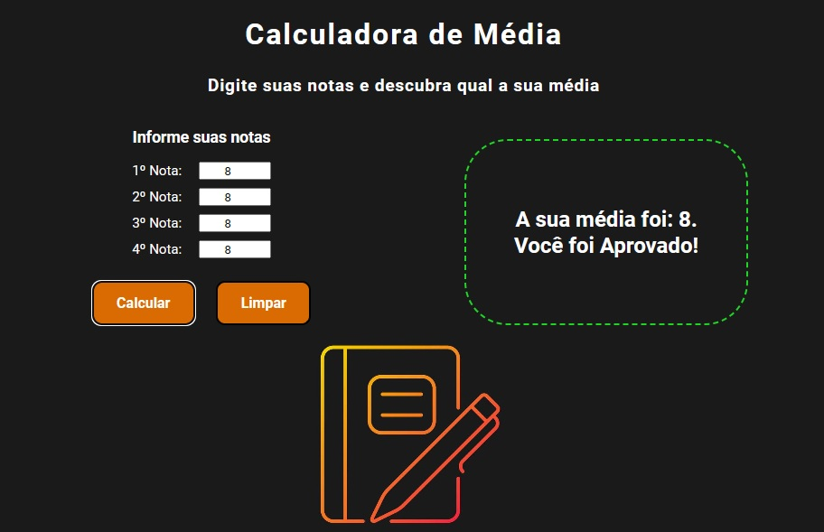
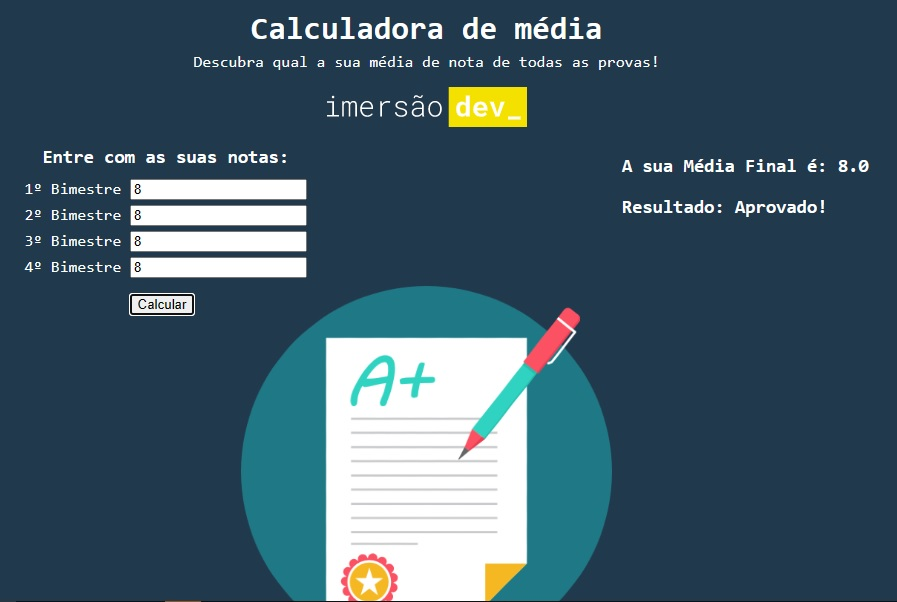

<h1 align="center"> CALCULADORA DE MÉDIA </h1>

Calculadora de média para notas escolares

  <a href="#-tecnologias">Tecnologias</a>&nbsp;&nbsp;&nbsp;|&nbsp;&nbsp;&nbsp;
  <a href="#-projeto">Projeto</a>&nbsp;&nbsp;&nbsp;|&nbsp;&nbsp;&nbsp;
  <a href="#-badge">Versões</a>&nbsp;&nbsp;&nbsp;

 

  

## 🚀 Tecnologias

Esse projeto foi desenvolvido com as seguintes tecnologias:

- HTML e CSS
- JavaScript
- Git e Github

## 💻 Projeto

A Calculadora de Média é um projeto feito com o objetivo de reforçar conhecimentos adquiridos nas tecnologias, além de permitir o calculo de médias para notas escolares.

## 📝 Versões

- Primeira Versão

  

